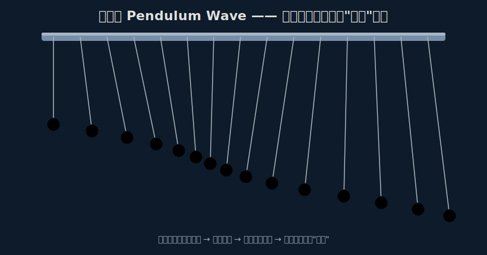

# 摆动波物理实验 · Pendulum Wave

一个视觉震撼、原理纯粹的高中物理演示实验。一排长度精心计算过的单摆同时释放后，
会先后形成「行波 → 多段波 → 散乱 → 重新同步」的催眠级视觉效果，全程约 1 分钟循环一次，
而背后只用到一个公式：单摆周期 `T = 2π√(L/g)`。



## 仓库内容

| 路径 | 说明 |
| --- | --- |
| `scripts/pendulum_lengths.py` | 计算每个摆长度的脚本，可导出 CSV / JSON |
| `web/index.html` | 浏览器实时模拟器，滑块可调数量、循环时间、摆角、速度 |
| `docs/lab-handout.md` | 实验讲义（Markdown） |
| `docs/print.html` | 打印友好版讲义，点「打印 / 导出 PDF」即可生成 PDF |
| `docs/lengths.csv` | 15 个摆的参考数据表 |
| `assets/pendulum_wave.svg` | 原理示意图 |

## 快速开始

打开模拟器（无需任何依赖）：

```bash
# 直接用浏览器打开 web/index.html，或：
python3 -m http.server 8000   # 然后访问 http://localhost:8000/web/
```

重新计算摆长（例如 20 个摆、循环 60 秒、小球半径 9 mm）：

```bash
python3 scripts/pendulum_lengths.py -n 20 -c 60 -b 51 -r 9 --csv docs/lengths.csv --json web/lengths.json
```

## 设计原理

设总循环时间 `T_cycle`（如 60 s），最长摆完成 `base` 次全振动，其后每个摆多 1 次：

```
N_k = base + (k - 1)          每个摆在一个循环内的振动次数
T_k = T_cycle / N_k           该摆的周期
L_k = g * (T_k / 2π)^2        该摆的长度
```

各摆相位逐渐错开形成行波；经过 `T_cycle` 后每个摆都完成整数次振动，重新排成直线。

详见 [实验讲义](docs/lab-handout.md)。
